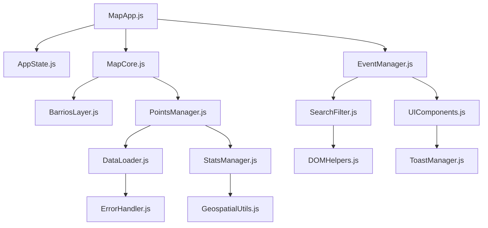

# 🤖 SISTEMA DE COORDINACIÓN MULTI-AGENTE

*Proyecto: Spatial Data Report | Barranquilla Limpia y Linda*  
*Agentes: Claude, Gemini, TRAE + Usuario Humano*  
*Fecha: 19 Septiembre 2025*

---

## 🎯 **ARQUITECTURA DE COORDINACIÓN**

### **👥 AGENTES INVOLUCRADOS**

#### **🔵 CLAUDE (yo)**
- **Especialidad:** Análisis arquitectónico, refactoring, documentación
- **Responsabilidades:** Coordinación general, análisis de código, plan estratégico
- **Archivos Asignados:** `COORDINACION_MULTI_AGENTE.md`, `CONTEXTO_COMPLETO.md`

#### **🟢 GEMINI** 
- **Especialidad:** Lógica de negocio, algoritmos, optimización de datos
- **Responsabilidades:** Modularización de script.js, manejo de datos GeoJSON
- **Archivos Asignados:** `src/modules/`, procesamiento de datos

#### **🟣 TRAE**
- **Especialidad:** UI/UX, frontend, experiencia de usuario
- **Responsabilidades:** Estilos, componentes visuales, responsive design
- **Archivos Asignados:** `src/styles/`, `index.html` (parte visual)

#### **👤 USUARIO HUMANO**
- **Rol:** Product Owner, decisiones finales, testing
- **Responsabilidades:** Validación, requerimientos del cliente, deploy
- **Control:** Commits, merge, deploy a producción

---

## 📋 **SISTEMA DE ESTADO COMPARTIDO**

### **🗂️ Archivo de Estado Central**
```json
// coordinacion_estado.json
{
  "project_status": {
    "phase": "modularization",
    "last_update": "2025-09-19T21:28:00Z",
    "active_agents": ["claude", "gemini", "trae", "human"]
  },
  "tasks": {
    "in_progress": {
      "claude": "analisis_arquitectura",
      "gemini": null,
      "trae": null,
      "human": "reviewing_plan"
    },
    "completed": ["context_analysis", "file_audit"],
    "blocked": []
  },
  "files": {
    "locked": {},
    "modified_by": {
      "src/components/script.js": "pending_modularization",
      "index.html": "human",
      "manifest.json": "human"
    }
  },
  "communication": {
    "last_sync": "2025-09-19T21:28:00Z",
    "pending_handoffs": [],
    "conflicts": []
  }
}
```

### **🔄 Protocolo de Sincronización**

#### **Antes de Trabajar:**
```bash
# 1. Verificar estado actual
python scripts/check_agent_status.py

# 2. Declarar intención de trabajo
python scripts/claim_task.py <agent_name> <task_id> <estimated_time>

# 3. Lock archivos que vas a modificar
python scripts/lock_files.py <agent_name> <file1> <file2>
```

#### **Durante el Trabajo:**
```bash
# Actualizar progreso cada 15 minutos
python scripts/update_progress.py <agent_name> <progress_percentage>

# Comunicar bloqueos inmediatamente
python scripts/report_blocker.py <agent_name> <blocker_description>
```

#### **Al Terminar:**
```bash
# 1. Unlock archivos
python scripts/unlock_files.py <agent_name>

# 2. Crear handoff si es necesario
python scripts/create_handoff.py <from_agent> <to_agent> <description>

# 3. Actualizar estado
python scripts/complete_task.py <agent_name> <task_id>
```

---

## 📁 **INVENTARIO DETALLADO: ARCHIVOS A ELIMINAR**

### **🗑️ ELIMINACIÓN INMEDIATA (Total: ~2.5MB)**

#### **Imágenes No Utilizadas (1.4MB)**
```bash
# JUSTIFICACIÓN: No se referencian en el código actual
src/assets/images/residuos 4.jpg     # 1.22MB - No usada
src/assets/images/residuos 5.jpg     # 87KB   - No usada  
src/assets/images/residuos2.jpg      # 29KB   - No usada
src/assets/images/residuos3.jpg      # 28KB   - No usada
src/assets/images/images.jpeg        # 13KB   - No usada
```

#### **Fuentes Volkswagen No Utilizadas (194KB)**
```bash
# JUSTIFICACIÓN: Fuentes corporativas no requeridas para proyecto público
src/assets/fonts/SoftMaker - Volkswagen Serial Bold.ttf         # 73KB
src/assets/fonts/SoftMaker - VolkswagenSerial-LightItalic.otf   # 41KB  
src/assets/fonts/SoftMaker - VolkswagenSerial.otf               # 40KB
src/assets/fonts/SoftMaker - VolkswagenSerial-Heavy.otf         # 39KB
```

#### **Logo Redundante (580KB)**
```bash
# JUSTIFICACIÓN: Tenemos versión PNG más optimizada
src/assets/logos/Alcaldia_Original_Black.jpg  # 580KB - Redundante
# MANTENER: Alcaldia_Original.png (153KB) - Más optimizado
```

#### **Scripts de Test Innecesarios**
```bash
# JUSTIFICACIÓN: Funcionalidad cubierta por debug-avanzado.html
minimal-test.js           # Script mínimo redundante
test-script.js           # Si existe
```

### **🗂️ CONSOLIDACIÓN RECOMENDADA**

#### **Documentación Metodológica (Reducir 15 → 3 archivos)**
```bash
# MANTENER (3 archivos esenciales):
Metodolygy_Process/PLAN_MEJORAS_INTEGRAL.md
Metodolygy_Process/GUIA_IMPLEMENTACION_PRACTICA.md  
Metodolygy_Process/CHECKLIST_MANUAL_TESTING.md

# ELIMINAR (12 archivos redundantes):
Metodolygy_Process/AGENT_COORDINATION_MATRIX.md      # Reemplazado por este archivo
Metodolygy_Process/ANALISIS_RENDIMIENTO.md           # Integrado en plan integral
Metodolygy_Process/ESTADO_CONTINUIDAD_FUNCIONAL.md   # Información duplicada
Metodolygy_Process/OPTIMIZACION_BARRIOS.md           # Específico técnico
Metodolygy_Process/PLAN_CONTINUIDAD_FUNCIONAL.md     # Duplicado
Metodolygy_Process/PLAN_DIVISION_TAREAS.md           # Reemplazado por coordinación
Metodolygy_Process/PLAN_ESPECIALIZADO.md             # Información integrada
Metodolyg_Process/estado_coordinacion.json          # Typo en nombre carpeta
Metodolygy_Process/estado_coordinacion.json         # Reemplazado por nuevo sistema
Metodolygy_Process/QUICK_START_COORDINATION.md      # Información básica
Metodolygy_Process/REVISION_CODIGO_FULLSTACK.md     # Integrado en plan integral
Metodolygy_Process/REVISION_CODIGO_SENIOR.md        # Duplicado
Metodolygy_Process/REVISION_MAPAS_Y_DEPLOYMENT.md   # Información específica
Metodolygy_Process/REVISION_TECNICA.md              # Duplicado
Metodolygy_Process/SISTEMA_COORDINACION_AGENTES.md  # Reemplazado por este archivo
Metodolygy_Process/README.md                        # Información básica
```

#### **Scripts de Coordinación (Simplificar)**
```bash
# CONSOLIDAR EN UNO SOLO:
scripts/coordination.py + scripts/coordinacion_agentes.py 
→ scripts/multi_agent_coordination.py
```

---

## 🏗️ **MODULARIZACIÓN TÉCNICA DETALLADA**

### **📊 ANÁLISIS DEL CÓDIGO MONOLÍTICO**

#### **Estado Actual: `src/components/script.js` (1,708 líneas)**

```javascript
// ANÁLISIS POR SECCIONES:
Líneas 1-50:    CONFIG y CONSTANTES              → config/constants.js
Líneas 51-229:  DATOS EDUCATIVOS OBSOLETOS       → ELIMINAR
Líneas 230-240: VARIABLES GLOBALES               → core/AppState.js  
Líneas 241-267: CLASE PRINCIPAL                  → core/MapApp.js
Líneas 268-400: INICIALIZACIÓN MAPA              → modules/MapCore.js
Líneas 401-449: EVENT LISTENERS                  → modules/EventManager.js
Líneas 450-568: CAPA BARRIOS                     → modules/BarriosLayer.js
Líneas 569-799: POPUPS Y ESTILOS                 → modules/UIComponents.js
Líneas 800-1100: CARGA DATOS                     → modules/DataLoader.js
Líneas 1101-1400: BÚSQUEDA Y FILTROS            → modules/SearchFilter.js
Líneas 1401-1500: UTILIDADES                    → utils/Helpers.js
Líneas 1501-1708: ESTADÍSTICAS Y TOAST          → modules/StatsManager.js
```

### **🔧 ESTRUCTURA MODULAR PROPUESTA**

```bash
src/
├── core/
│   ├── AppState.js         # Estado global de la aplicación
│   ├── MapApp.js          # Clase principal coordinadora
│   └── constants.js       # Constantes centralizadas
│
├── modules/
│   ├── MapCore.js         # Funcionalidad básica del mapa Leaflet
│   ├── DataLoader.js      # Carga de datos GeoJSON/JSON
│   ├── PointsManager.js   # Manejo de puntos críticos
│   ├── BarriosLayer.js    # Capa de barrios y polígonos
│   ├── SearchFilter.js    # Búsqueda y filtrado
│   ├── EventManager.js    # Gestión de eventos DOM
│   ├── UIComponents.js    # Componentes de interfaz
│   └── StatsManager.js    # Estadísticas y métricas
│
├── utils/
│   ├── DOMHelpers.js      # Utilidades DOM
│   ├── GeospatialUtils.js # Cálculos geoespaciales
│   ├── ErrorHandler.js    # Manejo de errores
│   └── ToastManager.js    # Sistema de notificaciones
│
└── interfaces/
    ├── IModule.js         # Interface para módulos
    ├── IDataProvider.js   # Interface para providers de datos
    └── IEventHandler.js   # Interface para manejadores de eventos
```

### **🔗 DEPENDENCIAS ENTRE MÓDULOS**



---

## 👥 **ASIGNACIÓN DE TAREAS POR AGENTE**

### **🔵 CLAUDE (Coordinador Técnico)**

#### **Semana 1: Arquitectura y Coordinación**
- [x] ✅ **Completado:** Análisis integral del proyecto
- [x] ✅ **Completado:** Sistema de coordinación multi-agente
- [ ] 🔄 **En Progreso:** Definición de interfaces y contratos
- [ ] 📋 **Pendiente:** Creación de archivos base modulares
- [ ] 📋 **Pendiente:** Sistema de logging y error handling

**Archivos Responsabilidad Claude:**
```bash
src/core/AppState.js
src/interfaces/*.js  
src/utils/ErrorHandler.js
scripts/multi_agent_coordination.py
```

### **🟢 GEMINI (Especialista en Lógica)**  

#### **Semana 1-2: Modularización de Lógica**
- [ ] 📋 **Pendiente:** Extraer y limpiar datos educativos obsoletos
- [ ] 📋 **Pendiente:** Crear `DataLoader.js` robusto
- [ ] 📋 **Pendiente:** Implementar `PointsManager.js`
- [ ] 📋 **Pendiente:** Desarrollar `SearchFilter.js` optimizado
- [ ] 📋 **Pendiente:** Algoritmos de optimización geoespacial

**Archivos Responsabilidad Gemini:**
```bash
src/modules/DataLoader.js
src/modules/PointsManager.js  
src/modules/SearchFilter.js
src/utils/GeospatialUtils.js
src/data/puntos_criticos.json (validación)
```

### **🟣 TRAE (Especialista UI/UX)**

#### **Semana 1-2: Interfaz y Experiencia**
- [ ] 📋 **Pendiente:** Implementar requerimientos visuales del cliente
- [ ] 📋 **Pendiente:** Crear `UIComponents.js` reutilizable
- [ ] 📋 **Pendiente:** Mejorar estética de popups y tarjetas
- [ ] 📋 **Pendiente:** Globos azules minimalistas para barrios
- [ ] 📋 **Pendiente:** Sistema de toasts mejorado

**Archivos Responsabilidad TRAE:**
```bash
src/modules/UIComponents.js
src/utils/ToastManager.js
src/styles/styles.css (refactor en componentes)
index.html (estructura visual mejorada)
```

### **👤 USUARIO HUMANO (Product Owner)**

#### **Semana 1: Validación y Decisiones**
- [ ] 🔍 **Review:** Aprobar eliminación de archivos (2.5MB)
- [ ] 🔍 **Testing:** Validar funcionalidad en diferentes dispositivos  
- [ ] 🔍 **Decisión:** Confirmar prioridades de requerimientos cliente
- [ ] 🔍 **Deploy:** Commit y push de cambios aprobados

---

## 🔄 **FLUJO DE TRABAJO COORDINADO**

### **🌊 FASE 1: Preparación (Días 1-2)**

#### **Día 1: Claude**
```bash
# TAREAS CLAUDE DÍA 1:
1. Crear estructura modular vacía
2. Definir interfaces y contratos  
3. Configurar sistema de coordinación
4. Eliminar archivos aprobados por humano
```

#### **Día 2: Paralelo Gemini + TRAE**
```bash
# GEMINI DÍA 2:
1. Análizar script.js sección por sección
2. Extraer datos educativos obsoletos
3. Crear DataLoader.js base

# TRAE DÍA 2:  
1. Crear UIComponents.js base
2. Implementar globos con ID (requerimiento cliente)
3. Mejorar popups con población impactada
```

### **🌊 FASE 2: Desarrollo Modular (Días 3-7)**

#### **Sincronización cada 2 días:**
- **Día 3:** Handoff Claude → Gemini (interfaces definidas)
- **Día 5:** Handoff Gemini → TRAE (datos estructurados)  
- **Día 7:** Integration testing todos los módulos

### **🌊 FASE 3: Integración (Días 8-10)**

#### **Testing coordinado:**
- **Claude:** Tests de integración entre módulos
- **Gemini:** Validación de datos y performance
- **TRAE:** Tests de UI/UX en múltiples dispositivos
- **Humano:** Acceptance testing final

---

## 🛠️ **HERRAMIENTAS DE COORDINACIÓN**

### **📝 Archivo de Comunicación: `AGENT_SYNC.md`**
```markdown
# SYNC STATUS - Updated: 2025-09-19 21:28

## CURRENT WORK
- Claude: Creating coordination system ⏳
- Gemini: Waiting for handoff 🟡
- TRAE: Waiting for handoff 🟡  
- Human: Reviewing plan 👀

## COMPLETED TODAY
- [Claude] Project analysis complete ✅
- [Claude] File audit complete ✅
- [Claude] Architecture design complete ✅

## BLOCKERS
- None currently 🟢

## HANDOFFS PENDING
- None currently

## NEXT SYNC: 2025-09-19 22:00
```

### **🤖 Scripts de Coordinación**

#### **`scripts/multi_agent_coordination.py`**
```python
#!/usr/bin/env python3
"""
Sistema de coordinación multi-agente para proyecto Mapa Barranquilla
Gestiona estado, locks de archivos, handoffs y sincronización
"""

import json, datetime, os

class MultiAgentCoordinator:
    def __init__(self):
        self.state_file = "coordinacion_estado.json"
        self.agents = ["claude", "gemini", "trae", "human"]
        
    def claim_task(self, agent, task, estimated_time):
        """Agente reclama una tarea"""
        pass
        
    def lock_files(self, agent, files):
        """Lock archivos para edición exclusiva"""
        pass
        
    def create_handoff(self, from_agent, to_agent, description):
        """Crear handoff entre agentes"""
        pass
        
    def update_status(self, agent, status):
        """Actualizar estado del agente"""
        pass
```

---

## 📊 **MÉTRICAS DE COORDINACIÓN**

### **⏱️ Tiempos Estimados por Fase**

```bash
FASE 1: Preparación           2 días
├── Claude (arquitectura)     1.5 días  
├── Gemini (análisis)         1 día
└── TRAE (diseño)            1 día

FASE 2: Desarrollo Modular    5 días  
├── Claude (core)             2 días
├── Gemini (lógica)          3 días
└── TRAE (UI)                3 días  

FASE 3: Integración          3 días
├── Testing individual        1 día
├── Testing integración       1 día  
└── Deploy y validación       1 día

TOTAL ESTIMADO: 10 días laborables
```

### **🎯 Objetivos de Calidad**

```bash
CODE QUALITY
├── Líneas de código: 1708 → <800
├── Archivos: 1 → 8 módulos  
├── Acoplamiento: Alto → Bajo
└── Test coverage: 0% → 60%+

PERFORMANCE
├── Bundle size: 2.8MB → <1MB
├── Load time: 3-4s → <2s
├── First paint: >2s → <1s
└── Mobile score: 85 → 95+

COORDINATION
├── Conflicts: Minimizar
├── Handoffs: Documentados
├── Sync frequency: Cada 2h
└── Communication: Async + structured
```

---

## 🚀 **NEXT STEPS INMEDIATOS**

### **🔥 PARA USUARIO HUMANO (AHORA)**
1. **Revisar y aprobar eliminación de archivos (2.5MB)**
   - ¿OK eliminar imágenes residuos no utilizadas?
   - ¿OK eliminar fuentes Volkswagen?
   - ¿OK consolidar documentación metodológica?

2. **Confirmar prioridades requerimientos cliente**
   - Globos con ID más importante que población impactada?
   - Lista sencilla vs. tarjetas estéticas - cuál priorizar?

3. **Dar luz verde para empezar modularización**

### **⏭️ SIGUIENTES AGENTES (DESPUÉS APROBACIÓN)**
1. **Claude:** Crear estructura modular y interfaces
2. **Gemini:** Empezar análisis detallado de script.js
3. **TRAE:** Diseñar componentes visuales mejorados

---

**✨ Este sistema garantiza coordinación efectiva entre todos los agentes sin conflictos, con comunicación estructurada y objetivos claros para cada uno.**